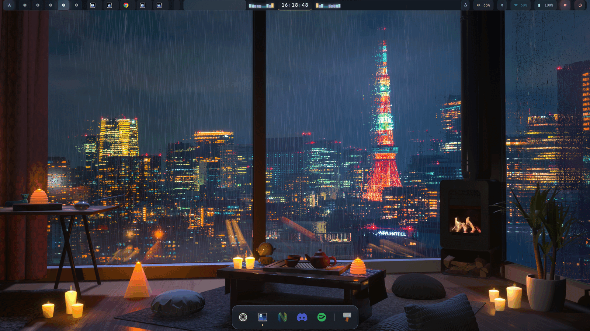
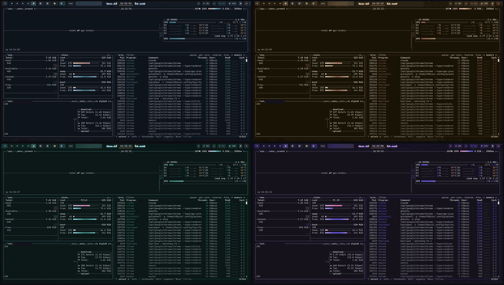
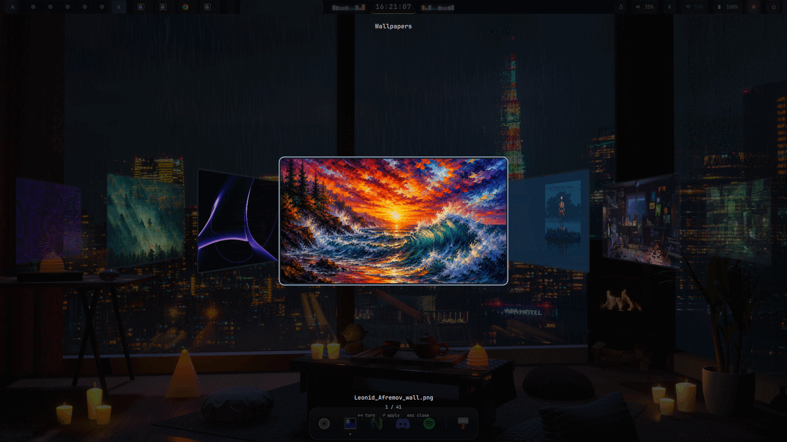
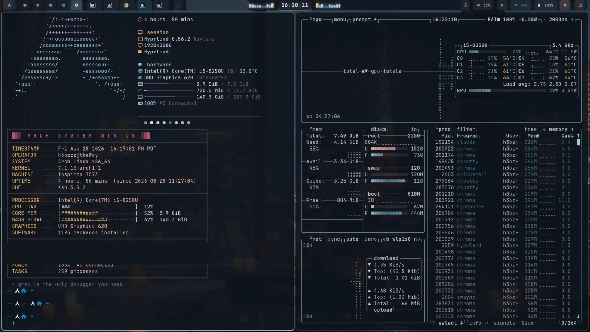

# h3bzzz's Hyprland rice

A Hyprland desktop where **the wallpaper is the theme**. Pick an image and the
bar, launcher, terminal, lock screen, notifications and system monitor are all
recoloured from it in one pass — not with a fixed palette that merely sits next
to the wallpaper, but with colours measured out of the image itself.



> Omarchy kept breaking on one of my desktops. I already had a Hyprland config
> I was building on my laptop and had grown used to, so I made it portable.
> Maybe someone else finds a use for it.

---

## The interesting part: wallpaper-driven theming

Everything visual is generated from one image by
[matugen](https://github.com/InioX/matugen) plus a small accent solver, then
written into twelve theme slots that every component reads.

```
 wallpaper
     │
     ├─ matugen  ──────────────►  structural slots
     │  (--source-color-index 0)   base surface overlay muted subtle text
     │
     └─ theme-accents.py ──────►  accent slots
        (image histogram)          love gold rose pine foam iris
                                        │
        ┌───────────────────────────────┴────────────────────────────┐
        ▼            ▼            ▼           ▼          ▼           ▼
     waybar        rofi        ghostty     hyprlock    swaync      btop
                             quickshell    hyprland
```

Two details are what make it actually match, and both were arrived at by
measuring the whole wallpaper library rather than by eye:

**The seed is the dominant colour, not the most saturated one.** matugen's
`--prefer saturation` picks the most *vivid* candidate, which in a photograph is
usually a minority detail — a neon sign, a lamp, a sunset edge. On a 36-image
library it landed on the wrong side of the colour wheel for **15 of 35** images:
a blue Tokyo Night wallpaper themed the entire desktop orange.
`--source-color-index 0` was wrong for **none** of them.

**Accents are assigned from the image, not interpolated toward it.** Rotating
each accent a fraction of the way toward the source hue lands it at a midpoint
that exists in neither the wallpaper nor the theme — the midpoint of pink→blue
is magenta. Instead `theme-accents.py` reads the image's real hue vocabulary
(ImageMagick histogram, weighted by area × saturation, merged into families) and
assigns slots to hues genuinely in the frame:

- the **dominant family owns the structural accents** (`iris`/`foam`/`pine`),
  fanned into an analogous chord so they read as three colours rather than one;
- a genuine secondary hue is spent on `rose` alone — one deliberate contrasting
  accent is a feature, three scattered ones are an accident;
- `love` (error) and `gold` (warning) stay **semantic**. They are re-hued only if
  the wallpaper actually has colour in the red/amber band, otherwise they
  harmonise within a 15° cap. A magenta "error" badge is a worse bar than an
  untinted one;
- lightness is taken verbatim from Rose Pine — that spread is the legibility
  contract, and no wallpaper gets a vote on it;
- every accent is lifted until it clears **3.0:1 contrast** against the generated
  background, because Rose Pine's lightnesses were chosen against Rose Pine's
  own base, not an arbitrary one.

Net effect over the library: accents sit **37% closer** to colours actually
present in the wallpaper, with zero regressions and no accent below the contrast
floor.

The same desktop under four wallpapers — nothing changed but the image. The bar,
the window chrome and every widget in `btop` follow it:



| wallpaper | `pine` accent |
| --- | --- |
| Tokyo Night (blue) | `#397587` |
| Gruvbox (warm) | `#8d583e` |
| Forest (green) | `#348c74` |
| Topographic (violet) | `#534ee2` |

Pick one with `SUPER + W`. The wheel is a Quickshell coverflow over
`~/Pictures/wallpapers`; scrolling costs nothing, and only committing a pick
re-derives the palette:



Re-theme at any time:

```bash
~/.config/hypr/scripts/apply-theme.sh          # from the current wallpaper
MATUGEN_SCHEME=scheme-content apply-theme.sh   # or override the scheme
```

---

## Components

| | |
| --- | --- |
| **Hyprland** | Lua-driven config (`hyprland.lua` + modular `lua/` includes) |
| **Waybar** | Centred clock flanked by cava audio-visualiser bars |
| **Quickshell** | App browser, session menu, and the coverflow wallpaper wheel |
| **Rofi** | Fullscreen grid launcher (type-3) + power menu (type-4) |
| **Ghostty** | Terminal, palette regenerated per wallpaper |
| **Hyprlock / Hypridle** | Lock screen; idle → screensaver → lock → DPMS → suspend |
| **Thornwatch** | Terminal screensaver — clock, vitals, recon and lore panels |
| **swaync** | Notification centre |
| **btop / cava / nvim / tmux / zsh** | Monitor, visualiser, LazyVim, multiplexer, p10k prompt |



---

## Install

Target is **Arch Linux + Hyprland**. Other distros get a best-effort package
pass; `matugen` and `quickshell` are AUR-only and required.

```bash
git clone https://github.com/h3bzzz/h3bzzz-dotfiles ~/h3bzzz-dotfiles
cd ~/h3bzzz-dotfiles

./install.sh --deps    # packages, oh-my-zsh, p10k, plugins, then deploy
./install.sh           # deploy only (idempotent — safe to re-run)
```

Then `hyprctl reload`, `chsh -s $(which zsh)`, and run `nvim` once to let
LazyVim install its plugins.

### How the deploy works

`install.sh` **symlinks** this repo into `~/.config` rather than copying it:

```
~/.config/hypr  ->  ~/h3bzzz-dotfiles/config/hypr
~/.config/waybar -> ~/h3bzzz-dotfiles/config/waybar
~/Pictures/wallpapers -> ~/h3bzzz-dotfiles/wallpapers
...
```

So editing `~/.config/hypr/lua/binds.lua` **is** editing the repo. Every change
you make to the rice shows up in `git status` with nothing to sync back by hand.

Anything already at those paths is moved to `<name>.bak-<timestamp>` first, and
re-running is a no-op on paths that are already correct.

### Generated files are not tracked

The twelve-slot palette is build output, regenerated whenever the wallpaper
changes. Tracking it would mean a commit per wallpaper switch, so `.gitignore`
excludes it and `install.sh` regenerates it. The *source* is
`config/matugen/templates/`.

A fresh clone therefore has no `colors.css` until `install.sh` (or
`apply-theme.sh`) has run once — waybar `@import`s it and will not start
without it.

### Secrets

`~/.config/zsh/secrets.zsh` is gitignored and sourced by `.zshrc`. Machine-local
API keys go there and never reach the repo. A `pre-commit` hook in `.githooks/`
blocks commits containing credential-shaped strings; `install.sh` enables it.

---

## Keybinds

`SUPER` is the mod key. Full list in `config/hypr/lua/binds.lua`.

| Key | Action |
| --- | --- |
| `SUPER + RETURN` | Terminal |
| `SUPER + Q` | Close window |
| `SUPER + R` | Launcher (rofi) |
| `SUPER + SPACE` | App browser (quickshell) |
| `SUPER + A` | Window switcher |
| `SUPER + W` | **Wallpaper wheel** — applying one re-themes everything |
| `SUPER + E` | File manager |
| `SUPER + V` | Toggle floating |
| `SUPER + Z` | Resize mode |
| `SUPER + H/J/K/L` or arrows | Focus direction |
| `SUPER + M` / `SUPER + SHIFT + M` | Toggle / move to scratchpad |
| `SUPER + N` | Notification panel |
| `SUPER + SHIFT + V` | Clipboard history |
| `SUPER + SHIFT + C` | Pick colour to clipboard |
| `Print` / `SUPER + Print` | Screenshot output / region |
| `SUPER + SHIFT + Print` | Screenshot + annotate (satty) |
| `SUPER + SHIFT + L` | Lock screen |
| `SUPER + CTRL + ESCAPE` | Toggle screensaver |
| `SUPER + ESCAPE` | Session menu |
| `SUPER + SHIFT + E` | Exit Hyprland |

Browser and tool launchers (`B` Zen, `F` Firefox, `G` Chrome, `Y` VS Code,
`U` Cursor, `I` Burp Suite, `O` Caido) are personal — edit `binds.lua` freely.

---

## Layout

```
h3bzzz-dotfiles/
├── install.sh              # symlink deploy + package bootstrap
├── .githooks/pre-commit    # credential guard
├── assets/                 # screenshots for this README
├── wallpapers/             # bundled wallpapers + CREDITS.md
└── config/
    ├── hypr/               # hyprland.lua, lua/, scripts/, thornwatch/, lock + idle
    │   ├── scripts/apply-theme.sh      # the theming pipeline
    │   └── scripts/theme-accents.py    # accent solver
    ├── matugen/            # config.toml + templates/  <- palette source of truth
    ├── waybar/  quickshell/  rofi/  wofi/  swaync/
    ├── ghostty/  cava/  btop/  nvim/  tmux/
    └── zsh/                # .zshrc + .p10k.zsh (linked into $HOME)
```

---

## Customising the theme

Change a **component's** colours by editing its template in
`config/matugen/templates/` — never the generated file, which is overwritten on
the next wallpaper change.

Change **how accents are derived** in `config/hypr/scripts/theme-accents.py`:
`ANCHORS` sets each slot's base hue and semantic window, `SAT_PULL` how far
saturation follows the wallpaper, and `CONTRAST_FLOOR` the legibility minimum.

Change the **scheme** with `MATUGEN_SCHEME`. The default is `scheme-vibrant`;
`scheme-content` produces noticeably greyer surfaces (mean saturation 0.105 vs
0.184 across the library), which is why it is not the default.

---

## Requirements

Installed by `./install.sh --deps`.

**Repo:** hyprland, hyprpaper, hyprlock, hypridle, xdg-desktop-portal-hyprland,
waybar, rofi-wayland, wofi, swaync, ghostty, cava, btop, neovim, tmux,
imagemagick, jq, python, socat, cliphist, wl-clipboard, grim, slurp,
brightnessctl, playerctl, pavucontrol, wireplumber, blueman, networkmanager,
thunar, papirus-icon-theme, ttf-jetbrains-mono-nerd, noto-fonts-emoji, zsh

**AUR:** `matugen-bin`, `quickshell` — both required.

**pipx:** [`terminaltexteffects`](https://github.com/ChrisBuilds/terminaltexteffects)
for the screensaver.

`imagemagick` is not optional: the accent solver reads the wallpaper's histogram
through `convert`.

---

## Credits

- [Rose Pine](https://rosepinetheme.com/) — the palette structure the twelve
  slots are built on
- [Hyprland](https://hyprland.org/), [matugen](https://github.com/InioX/matugen),
  [Quickshell](https://quickshell.outfoxxed.me/),
  [Neovim](https://neovim.io/), [oh-my-zsh](https://ohmyz.sh/),
  [Powerlevel10k](https://github.com/romkatv/powerlevel10k)
- [z.lua](https://github.com/skywind3000/z.lua) — directory jumping that learns
  your habits; worth having in any shell
- Wallpapers are third-party; see [`wallpapers/CREDITS.md`](./wallpapers/CREDITS.md)

Code in this repo is MIT (see `LICENSE`). The bundled wallpapers are **not**
covered by it — rights remain with their artists.
