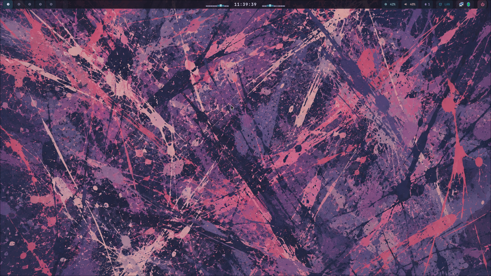
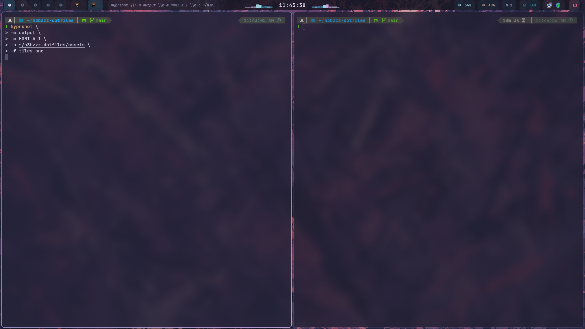

# h3bzzz's Hyprland Dotfiles

Omarchy kept on breaking on one of my desktops, I already had a hyprland configuration I was building on my laptop that I was really beginning to get used to. I thought it was time to be able to make this available for quick setup for me at anytime. Maybe someone else can find use in it.

# Hyprland setup with Waybar, Wofi, Cava, and custom screensaver

(hyprland with lua)




## Components

- **Lua-driven Hyprland config** (hyprland.lua with modular includes)
- **Neovim** - My setup with my preferred plugins (Thank you all contributors of neovim)
- **Waybar** with centered clock flanked by Cava audio visualizer bars
- **Rofi** app launcher (fullscreen grid) + power menu (with confirm dialog)
- **Wofi** app launcher + power menu (alternative)
- **Hyprlock** lockscreen with clock, date, caps warning
- **Hypridle** timed idle → screensaver → lock → DPMS → suspend
- **TTE screensaver** (terminal text effects in fullscreen ghostty)
- **`~/.config/hypr/current-wallpaper` symlink** tracks live wallpaper state

- Wallpaper picker via rofi (SUPER+W, browses `~/Pictures/wallpapers/`)

- **Hyprland** — Lua-driven config with modular includes
- **Waybar** — Top bar with Cava audio visualizer flanking a centered clock
- **Rofi** — Fullscreen grid launcher (type-3) + power menu with confirm dialog (type-4)
- **Wofi** — Alternative app launcher + power menu
- **Ghostty** — Terminal emulator (Rose Pine Moon theme, JetBrainsMono Nerd Font, 88% opacity)
- **Zsh** — Oh My Zsh + Powerlevel10k prompt + zsh-autosuggestions/syntax-highlighting/completions
- **Hyprlock** — Lockscreen with clock, date, caps-lock warning
- **Hypridle** — Timed idle → screensaver → lock → DPMS → suspend
- **Neovim** — LazyVim-based config with LSP, DAP, fuzzy finding, dashboard
- **Cava** — Audio visualizer with 3 bar configs + GLSL shaders
- **Screensaver** — TTE terminal text effects in fullscreen ghostty
- **Wallpaper picker** — Rofi-based (SUPER+W), browses `~/Pictures/wallpapers/`

> **Note:** [z.lua](https://github.com/skywind3000/z.lua) — a Lua-driven file navigation tool that learns your habits and lets you jump anywhere with minimal keystrokes. Works wonders in any Linux environment.

## Requirements

| Package                                                       | Purpose                                                                 |
| ------------------------------------------------------------- | ----------------------------------------------------------------------- |
| hyprland, hyprpaper, hyprlock, hypridle                       | WM + wallpaper + lock + idle                                            |
| waybar                                                        | Status bar                                                              |
| rofi-wayland, wofi                                            | App launchers                                                           |
| cava                                                          | Audio visualizer                                                        |
| swaync                                                        | Notifications                                                           |
| cliphist, wl-clipboard                                        | Clipboard manager                                                       |
| ghostty                                                       | Terminal emulator                                                       |
| zsh + oh-my-zsh + powerlevel10k                               | Shell + prompt                                                          |
| zsh-autosuggestions, zsh-syntax-highlighting, zsh-completions | Zsh plugins                                                             |
| ttf-jetbrains-mono-nerd                                       | UI font                                                                 |
| papirus-icon-theme                                            | Icons                                                                   |
| jq, python                                                    | Script dependencies                                                     |
| wireplumber, pavucontrol                                      | Audio                                                                   |
| playerctl                                                     | MPRIS media controls                                                    |
| blueman                                                       | Bluetooth                                                               |
| networkmanager                                                | Network                                                                 |
| tte                                                           | Screensaver ([github](https://github.com/nicoverbruggen/tte))           |
| hyprshutdown                                                  | Fancy shutdown ([AUR](https://aur.archlinux.org/packages/hyprshutdown)) |

## Install

```bash
git clone https://github.com/h3bzzz/h3bzzz-dotfiles
cd h3bzzz-dotfiles

# Install dependencies (auto-detect package manager)
./install.sh --deps

# Deploy configs (symlinks ~/.config/* → repo)
./install.sh
```

Restart Hyprland or `hyprctl reload`. Launch nvim once to trigger LazyVim install.

## Keybinds

| Key                    | Action                   |
| ---------------------- | ------------------------ |
| SUPER + RETURN         | Terminal                 |
| SUPER + Q              | Close window             |
| SUPER + A              | Rofi launcher            |
| SUPER + W              | Wallpaper picker         |
| SUPER + L              | Lock screen              |
| SUPER + V              | Toggle float             |
| SUPER + S              | Toggle special workspace |
| SUPER + 1-9            | Switch workspace         |
| SUPER + SHIFT + 1-9    | Move to workspace        |
| SUPER + arrows         | Focus direction          |
| SUPER + SHIFT + arrows | Move window              |

## Structure

```
~/.config/
├── hypr/           # Hyprland (lua), hyprlock, hypridle, hyprpaper, scripts, screensaver
├── waybar/         # Bar config, style, cava Python scripts
├── wofi/           # App launcher + power menu
├── rofi/           # App launcher (type-3) + power menu (type-4)
├── nvim/           # neovim config files
└── cava/           # Audio visualizer configs, themes, shaders

=======
├── hypr/       # Hyprland (lua), hyprlock, hypridle, hyprpaper, scripts, screensaver
├── waybar/     # Bar config, style, cava python scripts
├── wofi/       # App launcher + power menu
├── rofi/       # Launcher (type-3) + powermenu (type-4)
├── cava/       # Audio visualizer configs, themes, shaders
├── ghostty/    # Terminal emulator (Rose Pine Moon)
├── nvim/       # LazyVim-based Neovim config
└── zsh/        # .zshrc + .p10k.zsh (symlinked to $HOME)
```

## Credits

- [Rose Pine](https://rosepinetheme.com/) color palette
- [Hyprland](https://hyprland.org/)
- [Neovim](https://neovim.io/)
- [oh-my-zsh](https://ohmyz.sh/)
- [Arch Linux](https://archlinux.org/)
